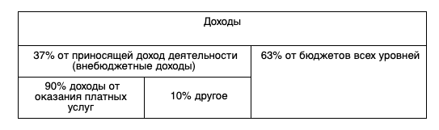
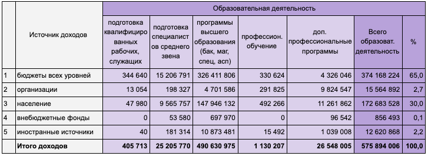
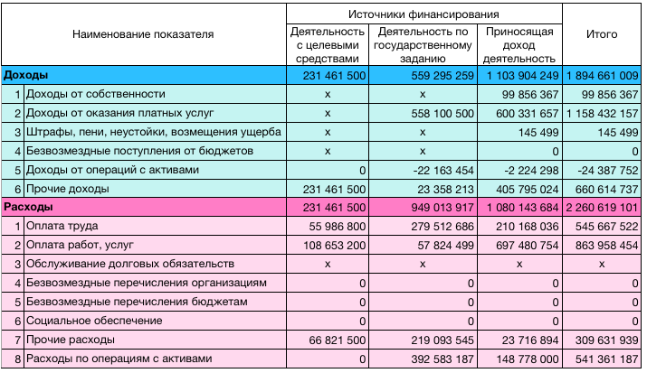

```{r setup, include=FALSE}
knitr::opts_chunk$set(echo = FALSE, warning=FALSE, message=FALSE)
```

```{r пакеты, include=FALSE}
library(rmdformats)
library(plyr)
library(ggforce)
library(knitr)
library(kableExtra)
library(dplyr)
library(readr)
library(fBasics)
library(formattable)
library(plotrix)
library(tidyr)
library(readxl)
library(stringr)
library(ggplot2)
library(tidyverse)
library(plotly)
library(patchwork)
library(ggsignif)
library(concaveman)
library(DT)
library(MissMech)
library(waffle)
library(openxlsx)
```

## Данные {-}

```{r данные}
finance_table_all <- read_excel("data/finance_table_all.xlsx")
df <- finance_table_all
nm <- colnames(finance_table_all)
nm1 <- nm[4:51]

df[nm1] <- lapply(df[nm1], function(x) gsub(",", ".", x))
df[nm1] <- lapply(df[nm1], function(x) as.numeric(gsub("[[:space:]]", "", x)))

merged_final <- df %>% 
  dplyr::filter(code_010_100_totalEndYear > 0) %>% 
  replace(is.na(.), 0) %>% 
  mutate(short_name = gsub("\"", "_", agencyName),
                      short_name = gsub("^.*\\ _", "", short_name),
                      short_name = gsub("_", "", short_name))

#availableMeansEndYear - Приносящая доход деятельность
#budgetActivityEndYear - Деятельность с целевыми средствами
#incomeActivityEndYear -Деятельность по государственному заданию
#totalEndYear - Итого
#<br/><br/>

# CЕМЕЙСТВА

finance_table_all <- read_excel("data/finance_table_all.xlsx")

df <- finance_table_all
nm <- colnames(finance_table_all)
nm1 <- nm[4:51]

df[nm1] <- lapply(df[nm1], function(x) gsub(",", ".", x))
df[nm1] <- lapply(df[nm1], function(x) as.numeric(gsub("[[:space:]]", "", x)))

merged_final <- df %>% 
  dplyr::filter(code_010_100_totalEndYear > 0) %>% 
  replace(is.na(.), 0)

rm(df,finance_table_all)
rm(nm,nm1)

additional_variables_coded <- read_excel("data/additional_variables_coded.xlsx")
additional_variables_coded <-  additional_variables_coded %>% mutate(family_profile2 = family_profile)
additional_variables_coded$family_profile <- car::recode(additional_variables_coded$family_profile,"'1'='Аграрные';
                           '2'='Культуры и искусств';
                           '3'='Технические';
                           '4'='Социальные и гуманитарные';
                           '5'='Медицинские';
                           '6'='Педагогические';
                           '7'='Классические';
                           '8'='Силовые и спортивные';
                           '9'='Муниципальные';
                           '10'='Частные'
                           ")
additional_variables_coded <- additional_variables_coded %>% select(1,5,14)

agencies_with_inn <- read_excel("data/agencies_with_inn.xlsx")
agencies_with_inn <- agencies_with_inn %>% select(1,3,4)

merged <- left_join(merged_final, agencies_with_inn, by = "agencyId")
#colnames(merged_final)
#colnames(agencies_with_inn)

merged_final <- left_join(merged, additional_variables_coded, by = c("id_monitoring"="id"))
#summary(merged_final)
#f <- merged_final %>% filter(is.na(family_profile2)) %>% select(3,53)
#write.csv(f  , "no_type_uni.csv", fileEncoding = "UTF-8")
#colnames(merged)
#colnames(additional_variables_coded)
merged_final <- merged_final %>% mutate(family_profile2 = 
                               case_when(agencyId == 280558 | agencyId ==  280252 ~ 7,
                                         agencyId == 284459 | agencyId ==  531526 ~ 3,
                                         agencyId == 285206 | agencyId ==  284151 ~ 9,
                                         agencyId == 144722 ~ 4,
                                         TRUE   ~  family_profile2)
                             ) %>% 
  mutate(family_profile = case_when(family_profile2 == "7" ~ "Классические",
                                    family_profile2 == "3" ~ "Технические",
                                    family_profile2 == "9" ~ "Муниципальные", 
                                    family_profile2 == "4" ~ "Социальные и гуманитарные",
                                    TRUE   ~  family_profile)
         )


merged_final <- merged_final %>%  mutate(short_name = gsub("\"", "_", agencyName),
                      short_name = gsub("^.*\\ _", "", short_name),
                      short_name = gsub("_", "", short_name))

# РЕГИОН

regions <- read_csv("data/regions.csv")
regions <- regions %>% select(-1)

merged_final <- left_join(merged_final, regions, by = c("id_monitoring"="id"))

merged_final[merged_final$short_name == "ФЕДЕРАЛЬНОЕ ГОСУДАРСТВЕННОЕ АВТОНОМНОЕ ОБРАЗОВАТЕЛЬНОЕ УЧРЕЖДЕНИЕ ВЫСШЕГО ОБРАЗОВАНИЯ ПЕРВЫЙ МОСКОВСКИЙ ГОСУДАРСТВЕННЫЙ МЕДИЦИНСКИЙ УНИВЕРСИТЕТ ИМЕНИ И.М. СЕЧЕНОВА МИНИСТЕРСТВА ЗДРАВООХРАНЕНИЯ РОССИЙСКОЙ ФЕДЕРАЦИИ (СЕЧЕНОВСКИЙ УНИВЕРСИТЕТ)", "short_name"] <- "МОСКОВСКИЙ ГОСУДАРСТВЕННЫЙ МЕДИЦИНСКИЙ УНИВЕРСИТЕТ ИМЕНИ И.М. СЕЧЕНОВА"

reg_type <- read_delim("data/reg_type.csv", ";", escape_double = FALSE, trim_ws = TRUE)
merged_final <- left_join(merged_final, reg_type, by = c("region_2017"="region"))


# ДОПОЛНИТЕЛЬНЫЕ ИЗ РОССТАТА

rosstat1 <- read_excel("data/rosstat_dop.xlsx", sheet = "Лист 1")
rosstat2 <- read_excel("data/rosstat_dop.xlsx", sheet = "Лист 2")


# полный мониторинг

monitoring_data_site <- read_excel("data/monitoring_data_site.xlsx")

```

На официальном сайте для размещения информации о государственных (муниципальных) учреждениях bus.gov.ru публикуются отчеты о финансовых результатах деятельности вузов. В них содержаться данные о доходах и расходах вузов. Мы скачали отчеты за 2018 год по 391 государственному вузу. Мы выбрали для анализа 2018 год, так как за этот год были доступны наиболее полные данные. Вообще по данным мониторинга эффективности в 2018 году насчитывалось 502 государственных вуза . Помимо очевидной проблемы, что не все государственные вузы публикуют эти отчеты,  существует проблема качества их заполнения – то есть, отчет загружен на сайт, но в нем представлены очевидно нереалистичные суммы, например, Дагестанский вуз в 2018 году потратил 0 рублей на оплату труда, а такой-то вуз потратил бла-бла-бла (посмотри пару отфильтрованных id). Такие вузы с нереалистичными отчетами мы тоже исключили из нашей выборки. Таким образом из 502 государственных вузов, которые работали в России в 2018 году у нас есть финансовые отчеты 391 вуза. Мы не обнаружили какого-либо смещения по регионам или семействам для вузов, которые не опубликовали отчет или опубликовали отчет с очевидными ошибками. То есть, мы предполагаем, вузы не попали в нашу выборку случайным образом, как минимум, по региональному признаку и принадлежности к семейству (см. Таблица 1). 

##### Таблица 1. Сопоставление выборки и генеральной совокупности по семействам, 2018 год {-}

```{r выборка}

# ДЛЯ ПОНИМАНИЯ ВЫБОРКИ

viborka <- left_join(agencies_with_inn, additional_variables_coded, by = c("id_monitoring"="id"))

vib <- full_join(viborka, merged_final, by = "id_monitoring")
vib2 <- vib %>% select(1,3,4,9,10,12)
vib2 <- left_join(vib2, regions, by = c("id_monitoring"="id"))

#colnames(vib2)
#summary(ee)

vib2 <- transform(vib2,id=as.numeric(factor(region_2017)))
vib_3 <- vib2 %>% filter(!is.na(family_profile.x)&!is.na(id))
vib_3 <- vib_3 %>% select(5,6,8)

# тест на случайность попадания в выборку
#TestMCARNormality(vib_3)
#TestMCARNormality(vib_3, del.lesscases = 1)

ee2 <- vib %>% dplyr::filter(is.na(agencyId.y)) %>% 
  group_by(family_profile.x) %>% 
  count() %>% 
  mutate(sh_full = 100*n/109) %>% 
  transmute(`кол-во вузов которые не попали к нам (n=109)` = n, `доли тех, кто не попал к нам.` = sh_full)

ee3 <- merged_final %>% group_by(family_profile) %>% 
  count() %>% 
  mutate(sh_our = 100*n/393) %>% 
  transmute(`кол-во вузов в нашей выборке (n=393)` = n, `доля в нашей выборке` = sh_our)
options(digits = 2)

ee4 <- full_join(ee2, ee3, by = c ("family_profile.x" = "family_profile"))

ee5 <- viborka %>% group_by(family_profile) %>% 
  count() %>% 
  mutate(sh_our = 100*n/502) %>% 
  transmute(`кол-во вузов в ген.совок. (n=502)` = n, `доля в ген.совок.` = sh_our)

options(digits = 2)

ee6 <- full_join(ee4, ee5, by = c ("family_profile.x" = "family_profile"))

ee6 <- ee6 %>% select(1,4,5,6,7)
#f <- datatable(ee6) 
#formatRound(f, columns=c(2:5), digits=0, interval = 0,
#  mark = "")
ee6
```

Немного подробнее о самих отчетах: они имеют матричную структуру (образец в упрощенной форме представлен в Приложении 2). В отчете мы можем видеть не только общую сумму доходов по различным статьям, но и источник финансирования этих доходов. То есть, мы можем видеть, что вуз оказал услуг на 100 рублей, при этом, 60 рублей получил из бюджета, а 40 рублей – внебюджетные источники (фирмы и население). То же самое и с расходами – мы видим, что вуз заплатил сотрудникам 100 рублей, и мы точно знаем, какая часть из этих 100 рублей это бюджетные деньги, а какая внебюджетные. 

Основным ограничением является то, что доходы и расходы разбиты на сильно укрупненные группы, поэтому мы не можем узнать о содержании строки “Доходы от оказания платных услуг”. Внутри находится не только образовательная деятельность вуза, но и научная. Таким образом, мы будем знать, откуда пополнялась эта строка – из бюджета или от фирм/населения, но не будем знать что там доходы от образовательных программ, а что доходы от научных исследований. 

Теперь подробнее о нашей выборке в 391 вуз (ТАМ ТОЧНО 391!??? СДЕЛАЙ НОРМАЛЬНЫЙ КОД, КОДА БУДЕШЬ РЕНДЕРИТЬ САЙТ). Распределение доходов среднего вуза представлено схематично в Таблице 2 – внебюджетные доходы составляют 37% от всех доходов вуза. Причем основная часть внебюджетных доходов – это доходы от оказания платных услуг (90%), то есть деньги студентов и фирм на образование и исследования. Остаются еще 10%, куда входят доходы от собственности, возмещение ущерба, операции с активами и прочее.

##### Таблица 2. Распределение доходов среднего вуза в нашей выборке {-}



В нашей выборке есть вузы, которые сильно отклоняются от значений среднего вуза (см. Таблицу 3). Есть вуз, у которого зафиксирована минимальная доля доходов от приносящей доход деятельности – 2,1%, это значит, что все остальные доходы он получает от бюджетов всех уровней. Из той же таблицы мы видим, что есть вуз, для которого 99,1 % доходов – это внебюджетные средства, а значит только 0,9 % этот вуз получает из бюджета. При этом такие выбросы, по всей видимости, не вносят сильного шума, так как среднее и медиана почти совпадают. Если смотреть на квартили, то мы видим, что для четверти вузов в нашей выборке доля внебюджетных доходов составляет более 47,3%.

##### Таблица 3. Описательные статистики доходов вузов {-}

```{r}

t3 <- merged_final %>% 
  dplyr::filter(agencyId != 154506 & agencyId != 164804) %>%
  mutate(inc_sh_gov = 100*(code_010_100_budgetActivityEndYear + code_010_100_incomeActivityEndYear)/code_010_100_totalEndYear,
                 inc_sh_mark = 100*code_010_100_availableMeansEndYear/code_010_100_totalEndYear,
                 cos_sh_gov = 100*(code_150_200_budgetActivityEndYear + code_150_200_incomeActivityEndYear)/code_150_200_totalEndYear,
                 cos_sh_mark = 100*code_150_200_availableMeansEndYear/code_150_200_totalEndYear) %>% 
  select(2,inc_sh_gov, inc_sh_mark, cos_sh_gov, cos_sh_mark) 

t3 <-   t3 %>%  select(-1)
  
colnames(t3)[2] <- "Доходы от приносящ. доход деятельн." 
colnames(t3)[1] <- "Доходы от бюджетов всех уровней"
colnames(t3)[4] <- "Расходы за счет приносящ. доход деятельн." 
colnames(t3)[3] <- "Расходы за счет бюджетов всех уровней"

J <- basicStats(t3)
J <- data.frame(t(J))

J <- formattable(J, digits = 2) %>% select(1:8)
#write.csv(J, "описательные_статистики.csv", fileEncoding = "UTF-8")
J
```

Сразу ограничим область наших интересов: нас интересовать не просто внебюджетные доходы вузов, а только доходы от образовательных и исследовательских услуг студентам и фирмам. То есть мы будем смотреть на блок 90% из Таблицы 2 и при этом игнорировать 10% блок c доходами от собственности, от операций с активами и прочим. 

Доля доходов, которые получает вуз за счет оказания платных услуг населению и организациям, в среднем составляет 33% от всех доходов вузов. В первую очередь это доходы от коммерческих студентов, выполнение научных исследований для сторонних организаций, программы дополнительного образования, повышения квалификации и прочее. Таким образом, треть доходов зависит от доходов населения и фирм, а значит, потенциально могут оказаться под угрозой при изменении рыночной среды. 

Следует отметить, что есть целая группа вузов, у которых доля таких доходов заметно выше среднего (все, кто сильно правее красной пунктирной линии на Рис. 5). У 43% вузов (170 из 392) доля собственных доходов выше среднего значения. Рассмотрим далее подробнее группу вузов, для которых доля внебюджетных доходов составляет основной источник дохода.

##### Рис. 5. Гистограммы распределения доходов вузов, завязанных на доходах населения и фирм {-}

```{r}
r1 <- merged_final %>% dplyr::filter(agencyId != 154506) %>% 
  mutate(inc_sh_mark = 100*code_040_130_availableMeansEndYear/code_010_100_totalEndYear) %>% select(agencyId,  inc_sh_mark) %>%
gather(key=agencyId, value=Value)  

f <- r1 %>% ggplot(aes(Value, fill = agencyId)) +
  geom_histogram(position = "identity", alpha = 0.7, fill = "#3333cc") +
  geom_vline(aes(xintercept = mean(Value)),col='red',size=0.6, linetype = 5)+
  labs(
    x = "Доходы от платных услуг (в % от общих доходов)",
    y = "Число вузов", 
    fill = NULL
  )  + theme_bw()+
  theme(legend.position = 'none' )
f + geom_text(aes(x=42, y=40,label='mean = 33%'), size=3.5) 
```

## Доходы вузов {-}

### Доходы в абсолютных значениях и долях

Посмотрим на доходы вузов абсолютных цифрах и в долях. Очевидно, что 30% от общих доходов для крупного столичного вуза и для региональной академии культуры это не одна и та же сумма в рублях. В первой десятке по абсолютным значениям мы видим заметный разброс (Табл. 4). К примеру, один из лидеров по абсолютным значениям – Высшая школа экономики с 7363 млн. руб внебюджетных доходов от услуг населению и фирмам, но в процентах это лишь треть от всех доходов вуза (34%), тогда как для РУДН сопоставимая сумма в рублях составляет почти две трети доходов (60%).

##### Таблица 4. Топ-10 вузов по доходам от платных услуг населению и фирмам (в рублях) с указанием какую долю составляют эти доходы от общих доходов {-}


```{r}
t4a <- merged_final %>% 
  mutate(
    budg = (code_040_130_incomeActivityEndYear + code_040_130_budgetActivityEndYear)/1000000,
    sh_mark_tot = 100*code_040_130_availableMeansEndYear/code_010_100_totalEndYear,
    tot = code_010_100_totalEndYear/1000000,
    code_040_130_availableMeansEndYear = code_040_130_availableMeansEndYear/1000000) %>% 
  select(short_name, code_040_130_availableMeansEndYear, sh_mark_tot) %>%
  arrange(desc(code_040_130_availableMeansEndYear))

colnames(t4a)[1] <- "Вуз" 
colnames(t4a)[2] <- "млн руб" 
colnames(t4a)[3] <- "% от общих доходов" 

sketch = htmltools::withTags(table(
  class = 'display',
  thead(
    tr(
      th(rowspan = 2, 'Вуз'),
      th(colspan = 2, 'Доходы от услуг населению и фирмам')
    ),
    tr(
      lapply(c('млн руб', '% от общих доходов'), th)
    )
  )
))

f <- datatable(t4a, container = sketch, rownames = FALSE)
formatRound(f, columns=c('млн руб', '% от общих доходов'), digits=0, interval = 0,
  mark = "")
#write.xlsx(t4a, "Табл 4а.xlsx")
#knitr::kable(t2 , booktabs = T, digits = 1) %>%
#column_spec(1, bold = T) %>%
# kable_styling(full_width = F, font_size=13)  %>% 
#  add_header_above(c(" ","Доходы от услуг населению и фирмам" = 2))
```

Если мы посмотрим топ вузов по доле внебюджетных доходов (таблица 6), то заметно, что большую часть из них составляют вузы социально-экономического профиля, что помогает привлекать студентов на привлекательные специальности по экономике, менеджменту, маркетингу и юриспруденции. Этот паттерн сохранится, если мы проанализируем отдельно 25% вузов с самыми высокими долями средств, заработанных самостоятельно. 

##### Таблица 6. Топ-10 вузов с самой большой долей доходов от оказания платных услуг населению и фирмам {-}

```{r}
t4 <- merged_final %>% dplyr::filter(agencyId != 154506) %>%
  mutate(inc_sh_mark = 100*code_040_130_availableMeansEndYear/code_010_100_totalEndYear) %>% 
  select(short_name,inc_sh_mark) %>% arrange(desc(inc_sh_mark)) #%>% top_n(10,inc_sh_mark)
  #mutate(short_name = firstup(tolower(short_name)))

colnames(t4)[1] <- "Вуз" 
colnames(t4)[2] <- "Доходы от платных услуг, %" 

#knitr::kable(t2 , booktabs = T, digits = 2) %>%
# kable_styling(full_width = F) #%>% 
#  row_spec(which(t2$family_profile2 > 8), background = "#e6e6ff")

f <- datatable(t4)
formatRound(f, columns=c('Доходы от платных услуг, %'), digits=0, interval = 0,
  mark = "")
```

Если мы посмотрим не на десятку лидеров, а на все вузы в нашей выборке, то мы увидим прямую зависимость (Рис. 3). Вузы, которые оперируют бóльшими суммами в рублях имеют бóльшую долю доходов от платных услуг. Вузы, которые оперируют меньшими суммами будут сильнее зависеть от государственных денег и хуже зарабатывать самостоятельно.

##### Рис. 3. Связь доли доходов от платных услуг с абсолютным их выражением в рублях {-}

```{r}
r1a <- merged_final %>% 
  mutate(budg = code_040_130_incomeActivityEndYear + code_040_130_budgetActivityEndYear,
         sh_mark_tot = 100*code_040_130_availableMeansEndYear/code_010_100_totalEndYear,
         tot = code_010_100_totalEndYear) %>% 
  select(short_name, code_040_130_availableMeansEndYear, budg, sh_mark_tot, tot, agencyId, family_profile)

colnames(r1a)[1] <- "univ" 
colnames(r1a)[2] <- "mark" 

#t2 <- formattable(t2)
#as.datatable(t2)

r1a %>% dplyr::filter(agencyId != 154506) %>% 
ggplot(aes(sh_mark_tot, mark)) + geom_point() +
 scale_y_continuous(trans='log10') +
 geom_smooth(method = "lm", se = FALSE) +
  labs(
    y = "Доход от платных услуг в рублях (логарифм)",
    x = "Доходы от платных услуг в % от общих доходов вуза", 
    fill = NULL)  + 
  theme_bw()+
  theme(legend.position = 'none' ) 
```

### Что объединяет вузы, у которых получается зарабатывать самостоятельно: семейства

Первое что мы сделаем – это разобьем наши вузы по типам, взяв за основу девять семейств (Рис. 4). 
```{r}
r4 <- merged_final %>% dplyr::filter(agencyId != 154506) %>% 
  mutate(inc_sh_mark = 100*code_040_130_availableMeansEndYear/code_010_100_totalEndYear) %>% 
  select(short_name,inc_sh_mark, family_profile) %>% group_by(family_profile) %>% summarise(
    uni_count = length(short_name), 
 #  median = median(inc_sh_mark), 
    mean = mean(inc_sh_mark)) 

p1 <- r4 %>% 
ggplot(aes(x=reorder(family_profile, mean), 
                       y=mean, 
                       fill = family_profile)) +
  geom_bar(stat="identity")+ coord_flip() + 
  scale_fill_manual(values = c("grey", "grey", "grey","red","grey", "grey", "grey","red","grey")) + geom_hline(yintercept=33, linetype="dashed")+
  geom_text(aes(x=1, y=40,label='mean = 33%'), size=3.5) +
  geom_text(aes(label=digits(mean,0)),hjust = 1.5, vjust=0.5, size=4)+
  labs(
    y = "Доходы от платных услуг \n (в % от общих доходов вуза)",
    fill = NULL
  ) +
  theme_bw() +
  theme(legend.position = 'none',
        axis.title.y = element_blank()) 

```

```{r}
p2 <- r4 %>% 
ggplot(aes(x=reorder(family_profile, mean), 
                       y=uni_count, 
                       fill = family_profile)) +
  geom_bar(stat="identity")+ coord_flip() + 
  scale_fill_manual(values = c("grey", "grey", "grey","red","grey", "grey", "grey","red","grey")) + 
  #geom_hline(yintercept=33, linetype="dashed")+
  #geom_text(aes(x=1, y=38,label='mean = 33%'), size=3.5) +
  geom_text(aes(label=digits(uni_count,0)),hjust = 1.5, vjust=0.5, size=4)+
  labs(
    y = "Колличество вузов в семействе (шт)",
    fill = NULL
  ) +
  theme_bw() +
  theme(legend.position = 'none',
        axis.title.y = element_blank(),
        axis.text.y=element_blank(),
        axis.ticks.y=element_blank()) 

```

##### Рис. 4.  A – Доходы от платных услуг населению и фирмам по типам вузов; В – Кол-во вузов в семействе {-}  

```{r}
p_all <- (p1 | p2)

p_all & theme(legend.position = 'none' ) &   plot_annotation(tag_levels = 'A' )
```

У социальных и гуманитарных вузов в среднем доля доходов от оказания платных услуг населению и фирмам составляет 55%, у медицинских – 48% . Хуже всего “зарабатывают” силовые, спортивные, культуры и искусств. Самые многочисленные семейства вузов имеют треть своих доходов от платных услуг населению и фирмам – технические и классические вузы. 

##### Рис. 4. Доходы от платных услуг населению и фирмам: <span style="color: #ff0000;"> среднее по семействам </span> {-}

```{r}

r1j <- merged_final %>% 
  mutate(inc_sh_mark = 100*code_040_130_availableMeansEndYear/code_010_100_totalEndYear,
         scost_sh = 100*code_160_210_totalEndYear/code_150_200_totalEndYear) %>% 
  select(inc_sh_mark, scost_sh, family_profile, agencyId) %>% filter(agencyId != 164804, agencyId != 154506)

g1 <- r1j %>% group_by(family_profile) %>% summarise(mean = mean(inc_sh_mark),
                                                     med = median(inc_sh_mark))


r1j %>% 
ggplot(aes(inc_sh_mark, y=reorder(family_profile, inc_sh_mark))) + 
  geom_point(alpha = 0.5) +
  geom_point(data=g1, aes(x=mean, y=family_profile), colour="red", size = 8, shape = "|") +
  geom_vline(aes(xintercept = mean(inc_sh_mark)),col='black',size=0.3, linetype = 5)+
  labs(
    x = "Доходы от платных услуг в % от общих доходов", 
    fill = NULL)  + 
  theme_bw()+
  theme(legend.position = 'none',
        legend.title = element_blank(),
        axis.title.y = element_blank())


```


Рассмотрим семейства более детально – в Таблице 5 представлены описательные статистики для всех семейств по доходам от платных услуг. 

(ОКРУГЛИ СРЕДНЕЕ ДО ОДИНАКОВОГО ЗНАКА ПОСЛЕ ЗАПЯТОЙ как на рисунке 4 выше)

##### Таблица 5. Доходы от платных услуг населению и фирмам по типам вузов (в % от общих доходов вузов) {-}

```{r}
t_r4_pers <- merged_final %>% dplyr::filter(agencyId != 154506) %>% 
  mutate(inc_sh_mark = 100*code_040_130_availableMeansEndYear/code_010_100_totalEndYear) %>% 
  select(short_name,inc_sh_mark, family_profile) %>% #group_by(family_profile) %>% 
  summarise(family_profile = "Всего по всем вузам",
            uni_count = length(short_name), 
            median = median(inc_sh_mark), 
            mean = mean(inc_sh_mark),
            var = var(inc_sh_mark),
            Q1 = quantile(inc_sh_mark, probs=c(0.25)),
            #Q2 = quantile(inc_sh_mark, probs=c(0.5)),
            Q3 = quantile(inc_sh_mark, probs=c(0.75))
 ) 

t_r4 <- merged_final %>% dplyr::filter(agencyId != 154506) %>% 
  mutate(inc_sh_mark = 100*code_040_130_availableMeansEndYear/code_010_100_totalEndYear) %>% 
  select(short_name,inc_sh_mark, family_profile) %>% group_by(family_profile) %>% 
  summarise(mean = mean(inc_sh_mark),
            median = median(inc_sh_mark), 
            var = var(inc_sh_mark),
            uni_count = length(short_name), 
            Q1 = quantile(inc_sh_mark, probs=c(0.25)),
            #Q2 = quantile(inc_sh_mark, probs=c(0.5)),
            Q3 = quantile(inc_sh_mark, probs=c(0.75))
 ) %>% arrange(desc(mean)) %>% bind_rows(t_r4_pers)

datatable(t_r4, rownames = T, # set rownames T
          options = list(columnDefs = list(list(visible = F, targets = 0)))) %>% 
formatRound(columns=c(2:8), digits=0, interval = 0, mark = "") %>% 
  formatStyle(0, target = "row",
              fontWeight = styleEqual(dim(t_r4)[1], "bold"))
```

Практически для всех типов вузов медиана близка к среднему значению – внутри семейств нет сильно заметного разброса значений по !внебюджетным! доходам (за исключением муниципальных вузов). Если в среднем социально-гуманитарные вузы зарабатывают больше остальных вузов, то это свойственно почти всем вузам этого типа (доля больше 45% собственных доходов характерна для 75% социально-гуманитарных вузов). Также как, если аграрные вузы в среднем получают вне бюджета не больше 27% доходов, то это свойственно почти 75% вузов.

Рассмотрим далее первый квартиль вузов, то есть на 25% вузов, которые самостоятельно зарабатывают больше остальных 75%. Мы упорядочили все вузы по размеру внебюджетных доходов и далее анализируем 25% вузов по семействам, у которых оказались самые высокие цифры. Из Таблицы 4 мы видим, что более 70% медицинских и социально-гуманитарных вузов входят в первый квартиль по доле доходов, заработанных самостоятельно. Для остальных семейств характерна картина, когда лишь для небольшого количества вузов доля собственных доходов будет значимо высока. Ни один силовой и спортивный вуз не попал, вузы культуры и искусств представлены только одним. 

##### Таблица 7. Доходы вузов от услуг населению и фирмам  (в % от общих доходов): семейства {-}

```{r}
t4a1 <- merged_final %>% dplyr::filter(agencyId != 154506) %>%
  mutate(
    budg = (code_040_130_incomeActivityEndYear + code_040_130_budgetActivityEndYear)/1000000,
    sh_mark_tot = 100*code_040_130_availableMeansEndYear/code_010_100_totalEndYear,
    tot = code_010_100_totalEndYear/1000000,
    code_040_130 = code_040_130_availableMeansEndYear/1000000) %>% 
  select(short_name, code_040_130, sh_mark_tot, family_profile) %>%
  arrange(desc(code_040_130)) %>% 
  mutate(code_040_130_q = ntile(code_040_130, 4),
         sh_mark_tot_q = ntile(sh_mark_tot, 4),
         sh_mark_tot_50 = case_when(sh_mark_tot >= 50 ~ "1",
                              TRUE   ~  "0"))

table1 <- t4a1 %>% dplyr::filter(sh_mark_tot_q == 4) %>% 
  group_by(family_profile) %>% 
  summarise(`кол-во вузов в Q4 (n = 98)` = n(),
            `mean \n Q4 (в %)` = mean(sh_mark_tot),
            `med \n Q4 (в %)` = median(sh_mark_tot)) %>% arrange(desc(`mean \n Q4 (в %)`))

table2 <- t4a1 %>% 
  group_by(family_profile) %>% 
  summarise(`кол-во вузов всего (n = 392)` = n(),
            `mean \n все вузы (в %)` = mean(sh_mark_tot),
            `med \n все вузы (в %)` = median(sh_mark_tot)) %>% arrange(desc(`mean \n все вузы (в %)`))
#sum(table1$`кол-во вузов в Q4 (n = 98)`)
table_1_2 <- full_join(table1,table2, by = "family_profile")
table_1_2 <- table_1_2 %>% mutate(`% вузов, попавиших в Q4` = 100*`кол-во вузов в Q4 (n = 98)`/`кол-во вузов всего (n = 392)`)
table_1_2 <- table_1_2 %>% select(1,3,4,2,8)


table12 <- t4a1 %>% dplyr::filter(sh_mark_tot_q == 4) %>% 
  #group_by(family_profile) %>% 
  summarise(`кол-во вузов в Q4 (n = 98)` = n(),
            `mean \n Q4 (в %)` = mean(sh_mark_tot),
            `med \n Q4 (в %)` = median(sh_mark_tot)) %>% arrange(desc(`mean \n Q4 (в %)`))

table22 <- t4a1 %>% 
  #group_by(family_profile) %>% 
  summarise(family_profile = "Всего по Q4",
            `кол-во вузов всего (n = 392)` = n(),
            `mean \n все вузы (в %)` = mean(sh_mark_tot),
            `med \n все вузы (в %)` = median(sh_mark_tot)) %>% arrange(desc(`mean \n все вузы (в %)`))
#sum(table1$`кол-во вузов в Q4 (n = 98)`)

table_1_2_2 <- bind_cols(table12,table22)
table_1_2_2 <- table_1_2_2 %>% mutate(`% вузов, попавиших в Q4` = 100*`кол-во вузов в Q4 (n = 98)`/`кол-во вузов всего (n = 392)`) 

table_1_2_2 <- table_1_2_2 %>% select(4,2,3,1,8)

table_1_2_2 <- bind_rows(table_1_2, table_1_2_2)

datatable(table_1_2_2, rownames = T, 
          options = list(columnDefs = list(list(visible = F, targets = 0)))) %>% 
formatRound(columns=c(2:5), digits=0, interval = 0, mark = "") %>% 
  formatStyle(0, target = "row",
              fontWeight = styleEqual(dim(table_1_2_2)[1], "bold"))

```

### Что объединяет вузы, у которых получается зарабатывать самостоятельно: регионы

Проанализируем различия по двум группам: (1) столичные вузы – Москва и Санкт-Петербург и (2) региональные вузы – остальные регионы России. Повторим тот же график как на Рис. 1, но с разбивкой на эти две группы.

##### Рис. 6. Связь доли доходов от платных услуг с абсолютным их выражением в рублях по группам регионов {-}

```{r}

r1g <- merged_final %>% 
  mutate(sh_mark = code_040_130_incomeActivityEndYear + code_040_130_budgetActivityEndYear,
         budg_good =  code_010_100_incomeActivityEndYear + code_010_100_budgetActivityEndYear,
         sh_mark_tot = 100*code_040_130_availableMeansEndYear/code_010_100_totalEndYear,
         tot = code_010_100_totalEndYear, 
         capital = case_when(region_2017 == "г.Москва" | region_2017 == "г.Санкт-Петербург" ~ "Столичные",
                                         TRUE   ~  "Региональные")) %>% 
  select(short_name, code_040_130_availableMeansEndYear, sh_mark_tot, region_2017,capital,budg_good, family_profile, agencyId)

colnames(r1g)[1] <- "univ" 
colnames(r1g)[2] <- "mark" 

r1g %>% dplyr::filter(agencyId != 154506) %>% 
ggplot(aes(sh_mark_tot, mark, colour = capital)) + geom_point(size = 2) +
scale_y_continuous(trans='log10') +
geom_smooth(method = "lm", se = FALSE, size = 0.7) +
  labs(
    y = "Деньги из бюджетов всех уровней в рублях (логарифм)",
    x = "Доходы от платных услуг в % от общих доходов вуза", 
    fill = NULL)  + 
  theme_bw()+
  theme(legend.position = 'bottom',
        legend.title = element_blank())

```

Мы видим на рис. 6 ожидаемый результат – облако московских и петербургских вузов в основном перемешано с облаком региональных, но вся верхняя область этого облака преимущественно голубого цвета –  это столичные вузы. То есть, когда мы говорим о топе вузов с самыми большими доходами от оказания услуг населению (в рублях), то это Москва и Санкт-Петербург. Но при этом вся правая и не самая верхняя часть – это региональные вузы, что означает, что среди региональных вузов больше тех вузов, для которых внебюджетные деньги – это главный доход.

В нашей выборке представлены государственные вузы из 79 регионов России. Нельзя сказать, что средний столичный вуз чем-то принципиально отличаются от среднего регионального по способности зарабатывать на платных услугах населению и фирмам. Тем не менее, мы можем сказать, что в ряде регионов мы наблюдаем сильное отклонение от среднего значения по стране. Например, в Краснодарском крае вузы в среднем получают 51% дохода от оказания платных услуг (напомним, что среднее по стране – 33%, медиана – 30%).


##### Таблица 5. Топ-10 регионов с самой большой долей доходов от оказания платных услуг населению и фирмам {-}

```{r}
t5 <- merged_final %>% dplyr::filter(agencyId != 154506) %>% 
  mutate(inc_sh_mark = 100*code_040_130_availableMeansEndYear/code_010_100_totalEndYear) %>% 
  select(short_name,inc_sh_mark, family_profile, region_2017) %>% 
  group_by(region_2017) %>% 
  summarise(mean = mean(inc_sh_mark),mediana = median(inc_sh_mark), uni_count = length(short_name)) %>% arrange(desc(mean)) # %>% top_n(10, mean)

colnames(t5)[4] <- "Кол-во вузов" 
colnames(t5)[2] <- "Средняя доля доходов (в %)" 
colnames(t5)[3] <- "Медиана (в %)" 
colnames(t5)[1] <- "Регионы"

f <- datatable(t5)
formatRound(f, columns=c(2:4), digits=0, interval = 0, mark = "")


#knitr::kable(t5 , booktabs = T, digits = 3) %>%
# kable_styling(full_width = F) 
```

Посмотрим на регионы, вузы которых меньше всего зарабатывают на платных услугах населению и фирмам. Например, в нашей выборке есть два вуза из Кабардино-Балкарской Республики, которые в среднем самостоятельно зарабатывают только 8.2% от своих общих доходов.

##### Таблица 6. Топ-10 регионов с самой маленькой долей доходов от оказания платных услуг населению и фирмам {-}

```{r}
t6 <- merged_final %>% dplyr::filter(agencyId != 154506) %>% 
  mutate(inc_sh_mark = 100*code_040_130_availableMeansEndYear/code_010_100_totalEndYear) %>% 
  select(short_name,inc_sh_mark, family_profile, region_2017) %>% 
  group_by(region_2017) %>% 
  summarise(mean = mean(inc_sh_mark),mediana = median(inc_sh_mark), uni_count = length(short_name)) %>% arrange(mean) # %>% top_n(10, mean)

colnames(t6)[4] <- "Кол-во вузов" 
colnames(t6)[2] <- "Средняя доля доходов (в %)" 
colnames(t6)[3] <- "Медиана (в %)" 
colnames(t6)[1] <- "Регионы"

f <- datatable(t6)
formatRound(f, columns=c(2:4), digits=0, interval = 0, mark = "")
#write.xlsx(t6, "Табл6.xlsx")

#knitr::kable(t2 , booktabs = T, digits = 3) %>%
 #kable_styling(full_width = F) 
```

У нас есть регионы, в которых мало государственных вузов, при этом такие регионы мы встречаем и в Таблице 5 и в Таблице 6. То есть, мы знаем примеры, когда регион сам по себе небольшой (в нем мало вузов), но при этом вузы в нем успешно получают доход от оказания платных услуг. Мы знаем примеры, когда регион также небольшой, но все доходы вузов в нем формируются преимущественно за счет бюджета. Среди крупных регионов, в которых много вузов, мы не найдем такой регион, в котором вузы преимущественно получают деньги только от бюджета. Другими словами, мы видим на данных некую государственную оптимизацию – «у вас мало вузов в регионе – деньги выделим в любом случае; у вас много вузов в регионе – мы не собираемся каждый из них полностью обеспечивать бюджетными деньгами». Если попробовать это визуализировать, то на Рис. 7 об оптимизации нам говорит полностью пустой верхний левый угол. То есть, у нас нет региона, в котором много вузов и при этом они не умеют зарабатывать самостоятельно.

##### Рис. 7. Связь числа вузов в регионе и доли доходов от платных услуг в этих вузах (без Москвы и Спб) {-}

```{r}
r5 <- merged_final %>% dplyr::filter(agencyId != 154506) %>% 
  mutate(
    inc_sh_mark = 100*code_040_130_availableMeansEndYear/code_010_100_totalEndYear) %>% 
  select(short_name,inc_sh_mark, family_profile, region_2017, type) %>% 
  group_by(region_2017, type) %>% 
  summarise(
    mean = mean(inc_sh_mark),
    mediana = median(inc_sh_mark), 
    uni_count = length(short_name))

r5 %>% filter(uni_count<20) %>% 
  ggplot() + geom_point(aes(x = mean, y = uni_count)) + geom_vline(xintercept=33, linetype="dashed", color = "red")+
  geom_text(aes(x=38, y=11,label='mean = 33%'), size=3.8) +
  labs(
    x = "Доходы от платных услуг (в % от общих доходов вуза)",
    y = "Число гос вузов в регионе", 
    fill = NULL
  )  + theme_bw() 
 # theme(legend.position = 'none' )
```

## Расходы вузов {-}

В среднем бюджет вуза сбалансирован, то есть все полученные от оказания платных услуг доходы финансируют какие-то статьи расходов. В первую очередь – оплату труда. 

! (СЮДА НУЖНА ГИСТОГРАММА С БАЛАНСОМ)!

Все расходы вузов мы разделим на три группы: (1) Оплата труда (зарплата и прочие начисления); (2) Оплата работ и услуг: (связь, транспорт, коммунальные платежи и др.); (3) Прочее (пособия по социальной помощи населению и др.). На рис. 8 показаны распределения по всем трем типам расходов.

##### Рис. 7. Гистограмма распределения расходов, финансируемых приносящей доход деятельностью {-}

```{r}
r7 <- merged_final %>% mutate(cos_sh_wage = 100*code_160_210_availableMeansEndYear/code_150_200_availableMeansEndYear,
                      cos_sh_rab_usl = 100*code_170_220_availableMeansEndYear/code_150_200_availableMeansEndYear,
                     cos_sh_ostalnoe =  
                       100*(code_190_230_availableMeansEndYear+
                              code_210_240_availableMeansEndYear+
                              code_230_250_availableMeansEndYear+
                              code_240_260_availableMeansEndYear+
                              code_250_290_availableMeansEndYear+
                              code_260_270_availableMeansEndYear)/code_150_200_availableMeansEndYear) %>% 
  
  select(2,cos_sh_wage, cos_sh_rab_usl,cos_sh_ostalnoe) %>% 
  mutate(inc = cos_sh_wage+ cos_sh_rab_usl++cos_sh_ostalnoe) %>% 
  arrange(desc(cos_sh_ostalnoe)) %>% dplyr::filter(cos_sh_wage != "NaN")

#t5b <- formattable(t5b)
#as.datatable(t5b)

r7 <- r7 %>% 
  #dplyr::filter(cos_sh_prochee > 0) %>% 
  select(agencyId,cos_sh_wage, cos_sh_rab_usl,cos_sh_ostalnoe) %>% 
  gather(key=agencyId, value=Value, cos_sh_wage, cos_sh_rab_usl,cos_sh_ostalnoe) %>% 
  mutate(agencyId = case_when(agencyId == "cos_sh_wage" ~ "оплата труда",
                              agencyId == "cos_sh_rab_usl" ~ "оплата работ (услуг)",
                              TRUE   ~  "прочее")) 

mu <- ddply(r7, "agencyId", summarise, grp.mean=mean(Value))

r7 %>% 
  ggplot(aes(Value, fill = agencyId)) +
  geom_histogram(position = "identity", alpha = 0.7) +
  geom_vline(data=mu, aes(xintercept=grp.mean, fill = agencyId),
             linetype="dashed")+
  scale_color_manual(values=c("#999999", "#E69F00", "#56B4E9"))+
  scale_fill_manual(values=c("#999999", "#E69F00", "#56B4E9"))+
  geom_text(aes(y=55, x=36,label='mean = 26%'), size=3.5, color = "#999999")+
    geom_text(aes(y=45, x=67,label='mean = 57%'), size=3.5, color = "#E69F00")+
      geom_text(aes(y=75, x=26,label='mean = 17%'), size=3.5, color = "#56B4E9")+
   labs(
    x = "Доли трех типов расходов (в %)",
    y = "Число вузов", 
    fill = NULL
  ) +
  theme_bw()
```

В среднем, оплата труда составляет 57% всех расходов, финансируемых приносящей доход деятельностью. Сосредоточимся в нашем анализе именно на оплате труда. Эту статью расходов можно назвать наиболее чувствительной. В случае сокращения доходов от приносящей доход деятельности, именно ее урезание приведет либо к увольнению сотрудников вузов, либо к сокращению их доходов. 

Напомним, что деньги от приносящей доход деятельности – это не только деньги студентов и фирм. Для нас эта деталь очень важна – из-за нее мы далее будем работать только с 360 вузами, а не с 391 как раньше. Мы вынуждены убрать из анализа вузы, которые получают серьезные доходы от собственности, операций с активами и прочего, не связанного с оказанием услуг студентам и фирмам. Либо вузы, которые вообще не финансируют оплату труда деньгами студентов и фирм. (ПОСМОТРИ НА ЭТИ ВУЗЫ, ВЫНЕСИ ИХ В ПРИЛОЖЕНИЕ и скажи тут пару слов об этих 30 вузах, они скорее зарабатывают собственностью или не тратят на зп)

В нашей выборке из 360 вузов посмотрим на те, которые финансируют большую часть расходов на оплату труда из денег студентов-платников и фирм. 

```{r}
t_base <- merged_final %>% 
  dplyr::filter(agencyId != 183965 & agencyId != 164804) %>% 
  mutate(
    all_inc = code_010_100_availableMeansEndYear/1000000, 
    mark_inc = code_040_130_availableMeansEndYear/1000000, 
    wage = code_160_210_availableMeansEndYear/1000000,
    dang = (code_160_210_availableMeansEndYear - (code_010_100_availableMeansEndYear - code_040_130_availableMeansEndYear))/1000000,
    all_w = code_160_210_totalEndYear/1000000,
    all_cost = 100*code_160_210_totalEndYear/code_150_200_totalEndYear,
    tot_cost = code_150_200_totalEndYear/1000000
    ) %>% 
  dplyr::filter(dang > 0)   %>%
  mutate(
    dang = abs(dang),
    dang_sh = 100*dang/all_w,
    ostat = (code_150_200_totalEndYear-code_160_210_totalEndYear)/1000000
    ) %>% 
  select(
    agencyId,
    all_inc, 
    mark_inc, 
    wage,
    dang,
    all_w,
    dang_sh,
    short_name,
    all_cost, 
    family_profile,
    region_2017,
    ostat,
    tot_cost
    )
#t_base %>% select(short_name, all_inc, mark_inc, wage, all_w, dang) %>%  datatable ()

```

##### Таблиц. 7 Расходы на оплату труда, финансируемые за счет денег студентов и фирм {-}

```{r}
t7 <- t_base %>% 
  select(short_name, all_w, dang, dang_sh) %>% arrange(desc(dang_sh))
colnames(t7)[4] <- "(в % от общих)" 
colnames(t7)[3] <- "(в млн. руб)" 
#colnames(t3)[3] <- "Расходы на оплату труда только за счет присносящ. дох. деятельн." 
colnames(t7)[2] <- "Общие  (в млн. руб)" 
colnames(t7)[1] <- "Вуз"

#knitr::kable(t3 , booktabs = T, digits = 0) %>%
# kable_styling(full_width = F, c("bordered")) %>% 
#  column_spec(1, bold = T) %>% 
#  column_spec(3, width = "8em") %>% 
#  column_spec(4, width = "9em", background = " #e6f2ff") %>% 
#  column_spec(2, width = "8em") %>% 
#  add_header_above(c(" ", " ", "Финансируемые за счет студентов и фирм" = 2)) %>%
#  add_header_above(c(" ", "Расходы на оплату труда" = 3))

sketch = htmltools::withTags(table(
  class = 'display',
  thead(
    tr(
      th(style="border-bottom:hidden", colspan = 1, ''),
      th(colspan = 3, 'Расходы на оплату труда')
      )
    ,
    tr(
      th(style="border-bottom:hidden",colspan = 1, ''),
      th(style="border-bottom:hidden",colspan = 1, ''),
      th(colspan = 2, 'Финансируемые за счет студентов и фирм')
      ),
    tr(
      th(colspan = 1, 'Вуз'),
      th(colspan = 1, 'Общие (в млн. руб)'),
      th(colspan = 1, '(в млн. руб)'),
      th(colspan = 1, '(в % от общих)')
    )
  )
))

f <- datatable(t7, rownames = FALSE, container = sketch)
formatRound(f, columns=c(2:4), digits=0, interval = 0,
  mark = "")

```

Из Таблицы 7 мы видим, что Воронежский институт экономики и социального управления потратил на оплату труда 25 млн руб, из которых как минимум 23 млн руб – деньги студентов и фирм, а 2 млн руб  – это все остальные деньги (от бюджетов всех уровней, от собственности, операций с активами и тд). То есть Таблица 7 по сути это топ вузов, у которых самая чувствительная статья расходов – оплата труда, финансируется за счет не самого стабильного источника – доходами от платных услуг населению и фирмам. 

Посмотрим что объединяет вузы, которые направляют внебюджетные средства главным образом на оплату труда. Таблица 8 содержит описательные статистики для каждого семейства. Социально-гуманитарные и медицинские вузы больше остальных типов вузов получают доходы от платных услуг, однако, они и больше остальных вузов направляют их на оплату труда – в среднем не менее 35% для первых и 30 для вторых. Другие типы вузов в основном оплату труда производят за счет бюджетного финансирования, что наиболее характерно для вузов культуры и искусств, а также силовых и спортивных вузов. 

##### Таблица 8. Расходы  на оплату труда, от платных услуг населению и фирмам по типам вузов (% от общих расходов вуза) {-}

```{r}
t_r4_pers <- t_base %>% dplyr::filter(agencyId != 154506) %>% 
  mutate(inc_sh_mark = 100*dang/tot_cost) %>% 
  select(short_name,inc_sh_mark, family_profile) %>% #group_by(family_profile) %>% 
  summarise(family_profile = "Всего по всем вузам",
            uni_count = length(short_name), 
            median = median(inc_sh_mark), 
            mean = mean(inc_sh_mark),
            var = var(inc_sh_mark),
            Q1 = quantile(inc_sh_mark, probs=c(0.25)),
            #Q2 = quantile(inc_sh_mark, probs=c(0.5)),
            Q3 = quantile(inc_sh_mark, probs=c(0.75))
 ) 

t_r4 <- t_base %>% dplyr::filter(agencyId != 154506) %>% 
  mutate(inc_sh_mark = 100*dang/tot_cost) %>% 
  select(short_name,inc_sh_mark, family_profile) %>% group_by(family_profile) %>% 
  summarise(mean = mean(inc_sh_mark),
            median = median(inc_sh_mark), 
            var = var(inc_sh_mark),
            uni_count = length(short_name), 
            Q1 = quantile(inc_sh_mark, probs=c(0.25)),
            #Q2 = quantile(inc_sh_mark, probs=c(0.5)),
            Q3 = quantile(inc_sh_mark, probs=c(0.75))
 ) %>% arrange(desc(mean)) %>% bind_rows(t_r4_pers)

datatable(t_r4, rownames = T,# set rownames T
          options = list(columnDefs = list(list(visible = F, targets = 0)))) %>% 
formatRound(columns=c(2:8), digits=1, interval = 0, mark = "") %>% 
  formatStyle(0, target = "row",
              fontWeight = styleEqual(dim(t_r4)[1], "bold"))

```

### Возможно, ли будет перераспределить доходы так, чтобы не сокращать особо чувствительные статьи расходов?

Нам интересна оплата труда, которая финансируется за счет студентов и фирм. Если у вуза снижается поток доходов из этого источника, то придется либо урезать оплату труда, либо перекидывать из других статей расходов. 

Таким образом нам интересно посмотреть на вузы, которые имеют самые большие расходы на оплату труда из денег студентов и фирм при этом у них самая маленькая величина всех остальных расходов, которые финансируются уже откуда угодно - бюджетом, доходами от собственности и тд, то есть мы ищем вузы, у которых почти нет других статей расходов, откуда потенциально можно было бы перекидывать средства, чтобы перенаправить на зарплату. 

##### Таблица 11. Топ вузов с самыми большими расходами на оплату труда из денег студентов и фирм при самой маленькой величине всех остальных расходов (в млн. руб.). {-}

```{r}
t8 <- t_base %>% 
  mutate(sh = 100*ostat/dang) %>% 
  select(short_name, dang, ostat, sh, all_w, tot_cost) %>% #filter(sh>=100) %>% 
  arrange(sh)

colnames(t8)[1] <- "Вуз" 
colnames(t8)[3] <- "Все остальные расходы из всех источников кроме расходов на оплату труда (млн руб) [3]"
colnames(t8)[2] <- "Оплата труда, финансируемая студентами и фирмами (млн руб) [2]"
colnames(t8)[4] <- "Доля [3] к [2] (%)"
colnames(t8)[5] <- "Расходы на зарплату из всех источников (млн руб)"
colnames(t8)[6] <- "Все расходы из всех источников (млн руб)"
#kable(t8, booktabs = T, digits = 0) %>%
#  kable_styling(full_width = F, c("bordered")) %>% 
#  column_spec(1, bold = T) %>% 
#  column_spec(2, width = "8em") %>% 
#  column_spec(3, width = "11em") %>% 
#  column_spec(4, width = "5em", background = "#f2e6ff") 

f <- datatable(t8)
f %>% formatRound(columns=c(2:7), digits=0, interval = 0,
  mark = "") %>% formatStyle(columns=c(4:4), background = "#ffcccc")
#write.xlsx(t8, "Таблица 8..xlsx")
```

В Краснодарском муниципальном медицинском институте 54 млн рублей из денег студентов и фирм пошли на оплату труда. Предположим, что вуз недополучит в следующем периоде денег от студентов и фирм, но не захочет увольнять сотрудников или урезать им зарплаты. Тогда можно перенаправить деньги, которые вуз пускал на другие статьи расходов (связь, транспорт, аренда, коммунальные платежи и прочее). Вопрос, а сколько этих денег, которые потенциально можно перенаправить, есть у вуза? У Краснодарского муниципального медицинского института все остальные расходы, не связанные с зарплатой составляют 12 млн руб. 

Таким образом, Таблица 11 это фактически топ вузов, у которых возможность какого-либо маневра сведена к минимуму. Если Краснодарский муниципальный медицинский институт недополучит, допустим, 12 млн руб от студентов и фирм, то он сможет не сокращать расходы на оплату труда только при условии, что ни на связь, ни на транспорт ни на всё прочее он вообще не потратит ни рубля. 


“может они смогут взять деньги из бюджета” сильнее акцентировать внимание выше на то, что они не могут, что бюджет уже сиди внутри

Таблица 12 показывает, как много вузов с ограниченным маневром для каждого семейства. Всего в нашей выборке мы зафиксировали 14% вузов, которым будет затруднительно перераспределить расходы в случае необходимости восполнить потери от внебюджетных средств. Мы опять видим, что такие вузы чаще встречаются среди категорий вузов с заметной долей внебюджетного финансирования – социально-гуманитарные и медицинские вузы. 


##### Таблица 11. {-}

```{r}
t1 <- t_base %>% 
  mutate(sh = 100*ostat/dang) %>% 
  select(short_name, dang, ostat, sh, all_w, tot_cost, family_profile) %>% filter(sh<100) %>% 
  group_by(family_profile) %>% summarise(n_less_100 = length(short_name),
                                         mean_less_100 = mean(sh)) %>% 
  arrange(mean_less_100) 

t1_2 <- t_base %>% 
  mutate(sh = 100*ostat/dang) %>% 
  select(short_name, dang, ostat, sh, all_w, tot_cost, family_profile) %>% filter(sh<100) %>% 
  summarise(family_profile = "Всего",
            n_less_100 = length(short_name),
            mean_less_100 = mean(sh)) 
t1 <- bind_rows(t1,t1_2)

t2 <- t_base %>% 
  mutate(sh = 100*ostat/dang) %>% 
  select(short_name, dang, ostat, sh, all_w, tot_cost, family_profile) %>% #filter(sh>=100) %>% 
  group_by(family_profile) %>% summarise(n_all = length(short_name),
                                         mean_all = mean(sh)) %>% 
  arrange(mean_all) 

t2_2 <- t_base %>% 
  mutate(sh = 100*ostat/dang) %>% 
  select(short_name, dang, ostat, sh, all_w, tot_cost, family_profile) %>% 
  summarise(family_profile = "Всего",
            n_all = length(short_name),
            mean_all = mean(sh)) 
t2 <- bind_rows(t2,t2_2)

t3 <- t1 %>% left_join(t2, by= "family_profile") %>% mutate(share_in = 100*n_less_100/n_all)

colnames(t3)[1] <- "Семейство" 
colnames(t3)[2] <- "Вузы с ограниченным маневром"
colnames(t3)[4] <- "Всего вузов в семействе"
colnames(t3)[6] <- "% вузов в семействе с ограниченным маневром"
colnames(t3)[3] <- "% покрытия расходов на оплату труда, в случае потери доходов от студентов и фирм для вузов с ограниченным маневром"
colnames(t3)[5] <- "% покрытия расходов на оплату труда, в случае потери доходов от студентов и фирм для всех вузов"
t3 <- t3 %>% select(1,2,4,6,3,5)

f <- datatable(t3)
f %>% formatRound(columns=c(2:6), digits=0, interval = 0,
  mark = "") %>% formatStyle(columns=c(5:6), background = "#ffcccc")

```
 
## Выводы {-}

Внебюджетные доходы составляют в среднем 37% от всех доходов вуза; только для 25% вузов в нашей выборке доля внебюджетных доходов составляет более 47%. 

Большая часть внебюджетных доходов – это доходы от оказания платных услуг по образовательным программам и проведению исследований (в среднем 90% внебюджетных средств).

Вузы, которые оперируют бóльшими суммами в рублях, являются и более независимыми от бюджетных денег (имеют бóльшую долю доходов от платных услуг).

У 43% вузов (170 из 392) доля собственных доходов выше среднего значения по всей выборке.
Внебюджетное финансирование распределено неравномерно по типам вузов. У социальных и гуманитарных вузов в среднем доля доходов от оказания платных услуг населению и фирмам составляет 55%, у медицинских – 48% (см. рис. 4). Хуже всего “зарабатывают” силовые, спортивные, культуры и искусств. Самые многочисленные семейства вузов имеют треть своих доходов из внебюджетных источников – технические и классические вузы. 

Внутри семейств нет сильно заметного разброса значений по внебюджетным доходам (за исключением муниципальных вузов). Если в среднем социально-гуманитарные вузы зарабатывают больше остальных вузов, то это свойственно почти всем вузам этого типа, также и наоборот.

Вузы с самыми большими доходами от оказания услуг населению (в рублях) – это чаще столичные вузы; среди региональных вузов больше тех вузов, для которых внебюджетные деньги – это главный доход.

Социально-гуманитарные и медицинские вузы больше остальных типов вузов получают доходы от платных услуг, однако, они и больше остальных вузов направляют их на оплату труда – в среднем не менее 35% для первых и 30 для вторых. Другие типы вузов в основном оплату труда производят за счет бюджетного финансирования, что наиболее характерно для вузов культуры и искусств, а также силовых и спортивных вузов. 

Всего в нашей выборке мы зафиксировали 14% вузов, которым будет затруднительно перераспределить расходы в случае необходимости восполнить потери от внебюджетных средств. Такие вузы встречаются среди всех категорий, однако, чаще это социально-гуманитарные и медицинские вузы. 

Тем самым, те, кто живет на внебюджетные доходы, находятся в зоне риска, так как у них доля расходов на оплату труда выше, а «остаток» для покрытия дополнительных расходов меньше в сравнении с бюджетными по доходам вузами. 

Парадоксально, но большей свободой для траты внебюджетных средств обладают, по сей видимости, те вузы, для которых доходы от платных услуг составляют не самую значимую роль, так как основные большие статьи расходов они покрывают за счет бюджетных средств.

## Приложения {-}

##### Приложение 1. <span style="background-color: #ffe6ff"> (в тыс. руб) </span> {-}



##### Приложение 2. Упрощенная версия отчета о финансовых результатах деятельности {-}




```{r}

p_s <- merged_final %>% dplyr::filter(agencyId != 154506) %>% 
  mutate(
    inc_mark = code_040_130_availableMeansEndYear/1000000,
    inc_sh_mark = 100*code_040_130_availableMeansEndYear/code_010_100_totalEndYear
    ) %>% 
  select(short_name, inc_sh_mark, inc_mark, family_profile) %>% 
  arrange(desc(inc_sh_mark))

colnames(p_s)[1] <- "Топ вузов" 
colnames(p_s)[2] <- "в % от общих" 
colnames(p_s)[3] <- "млн. руб" 
colnames(p_s)[4] <- "Семейство" 

datatable(p_s, filter = list(position = 'top', clear = FALSE, plain = TRUE), options = list(
  pageLength = 5, autoWidth = TRUE
)) %>% 
  formatRound(columns=c(2,3), digits=0, interval = 0, mark = "")

```


### Приложение 3. Топ-10 вузов по доходам от платных услуг населению и фирмам: в млн. рублей и в % от общих доходов вуза {-} {.tabset}

```{r}
#1
p_s_1 <- merged_final %>% dplyr::filter(agencyId != 154506) %>% 
  mutate(inc_sh_mark = 100*code_040_130_availableMeansEndYear/code_010_100_totalEndYear) %>% 
  select(short_name, inc_sh_mark, family_profile) %>% 
  filter(family_profile == "Социальные и гуманитарные") %>% 
  arrange(desc(inc_sh_mark)) %>% slice(1:10) %>% select(-family_profile)

p_s_2 <- merged_final %>% dplyr::filter(agencyId != 154506) %>% 
  mutate(inc_mark = code_040_130_availableMeansEndYear/1000000) %>% 
  select(short_name, inc_mark, family_profile) %>% 
  filter(family_profile == "Социальные и гуманитарные") %>% 
  arrange(desc(inc_mark)) %>% slice(1:10) %>% select(-family_profile)

p_s <- bind_cols(p_s_1,p_s_2) 
colnames(p_s)[1] <- "Топ-10 вузов - Социальные и гуманитарные" 
colnames(p_s)[2] <- "в %" 
colnames(p_s)[3] <- "Топ-10 вузов - Социальные и гуманитарные" 
colnames(p_s)[4] <- "млн. руб" 
#2
p_m_1 <- merged_final %>% dplyr::filter(agencyId != 154506) %>% 
  mutate(inc_sh_mark = 100*code_040_130_availableMeansEndYear/code_010_100_totalEndYear) %>% 
  select(short_name, inc_sh_mark, family_profile) %>% 
  filter(family_profile == "Медицинские") %>% 
  arrange(desc(inc_sh_mark)) %>% slice(1:10) %>% select(-family_profile)

p_m_2 <- merged_final %>% dplyr::filter(agencyId != 154506) %>% 
  mutate(inc_mark = code_040_130_availableMeansEndYear/1000000) %>% 
  select(short_name, inc_mark, family_profile) %>% 
  filter(family_profile == "Медицинские") %>% 
  arrange(desc(inc_mark)) %>% slice(1:10) %>% select(-family_profile)

p_m <- bind_cols(p_m_1,p_m_2) 
colnames(p_m)[1] <- "Топ-10 вузов - Медицинские" 
colnames(p_m)[2] <- "в %" 
colnames(p_m)[3] <- "Топ-10 вузов - Медицинские" 
colnames(p_m)[4] <- "млн. руб"
#3
p_t_1 <- merged_final %>% dplyr::filter(agencyId != 154506) %>% 
  mutate(inc_sh_mark = 100*code_040_130_availableMeansEndYear/code_010_100_totalEndYear) %>% 
  select(short_name, inc_sh_mark, family_profile) %>% 
  filter(family_profile == "Технические") %>% 
  arrange(desc(inc_sh_mark)) %>% slice(1:10) %>% select(-family_profile)

p_t_2 <- merged_final %>% dplyr::filter(agencyId != 154506) %>% 
  mutate(inc_mark = code_040_130_availableMeansEndYear/1000000) %>% 
  select(short_name, inc_mark, family_profile) %>% 
  filter(family_profile == "Технические") %>% 
  arrange(desc(inc_mark)) %>% slice(1:10) %>% select(-family_profile)

p_t <- bind_cols(p_t_1,p_t_2) 
colnames(p_t)[1] <- "Топ-10 вузов - Технические" 
colnames(p_t)[2] <- "в %" 
colnames(p_t)[3] <- "Топ-10 вузов - Технические" 
colnames(p_t)[4] <- "млн. руб"
#4
p_k_1 <- merged_final %>% dplyr::filter(agencyId != 154506) %>% 
  mutate(inc_sh_mark = 100*code_040_130_availableMeansEndYear/code_010_100_totalEndYear) %>% 
  select(short_name, inc_sh_mark, family_profile) %>% 
  filter(family_profile == "Классические") %>% 
  arrange(desc(inc_sh_mark)) %>% slice(1:10) %>% select(-family_profile)

p_k_2 <- merged_final %>% dplyr::filter(agencyId != 154506) %>% 
  mutate(inc_mark = code_040_130_availableMeansEndYear/1000000) %>% 
  select(short_name, inc_mark, family_profile) %>% 
  filter(family_profile == "Классические") %>% 
  arrange(desc(inc_mark)) %>% slice(1:10) %>% select(-family_profile)

p_k <- bind_cols(p_k_1,p_k_2) 
colnames(p_k)[1] <- "Топ-10 вузов - Классические" 
colnames(p_k)[2] <- "в %" 
colnames(p_k)[3] <- "Топ-10 вузов - Классические" 
colnames(p_k)[4] <- "млн. руб"
#5
p_p_1 <- merged_final %>% dplyr::filter(agencyId != 154506) %>% 
  mutate(inc_sh_mark = 100*code_040_130_availableMeansEndYear/code_010_100_totalEndYear) %>% 
  select(short_name, inc_sh_mark, family_profile) %>% 
  filter(family_profile == "Педагогические") %>% 
  arrange(desc(inc_sh_mark)) %>% slice(1:10) %>% select(-family_profile)

p_p_2 <- merged_final %>% dplyr::filter(agencyId != 154506) %>% 
  mutate(inc_mark = code_040_130_availableMeansEndYear/1000000) %>% 
  select(short_name, inc_mark, family_profile) %>% 
  filter(family_profile == "Педагогические") %>% 
  arrange(desc(inc_mark)) %>% slice(1:10) %>% select(-family_profile)

p_p <- bind_cols(p_p_1,p_p_2) 
colnames(p_p)[1] <- "Топ-10 вузов - Педагогические" 
colnames(p_p)[2] <- "в %" 
colnames(p_p)[3] <- "Топ-10 вузов - Педагогические" 
colnames(p_p)[4] <- "млн. руб"
#6
p_a_1 <- merged_final %>% dplyr::filter(agencyId != 154506) %>% 
  mutate(inc_sh_mark = 100*code_040_130_availableMeansEndYear/code_010_100_totalEndYear) %>% 
  select(short_name, inc_sh_mark, family_profile) %>% 
  filter(family_profile == "Аграрные") %>% 
  arrange(desc(inc_sh_mark)) %>% slice(1:10) %>% select(-family_profile)

p_a_2 <- merged_final %>% dplyr::filter(agencyId != 154506) %>% 
  mutate(inc_mark = code_040_130_availableMeansEndYear/1000000) %>% 
  select(short_name, inc_mark, family_profile) %>% 
  filter(family_profile == "Аграрные") %>% 
  arrange(desc(inc_mark)) %>% slice(1:10) %>% select(-family_profile)

p_a <- bind_cols(p_a_1,p_a_2) 
colnames(p_a)[1] <- "Топ-10 вузов - Аграрные" 
colnames(p_a)[2] <- "в %" 
colnames(p_a)[3] <- "Топ-10 вузов - Аграрные" 
colnames(p_a)[4] <- "млн. руб"
#7
p_ss_1 <- merged_final %>% dplyr::filter(agencyId != 154506) %>% 
  mutate(inc_sh_mark = 100*code_040_130_availableMeansEndYear/code_010_100_totalEndYear) %>% 
  select(short_name, inc_sh_mark, family_profile) %>% 
  filter(family_profile == "Силовые и спортивные") %>% 
  arrange(desc(inc_sh_mark)) %>% slice(1:10) %>% select(-family_profile)

p_ss_2 <- merged_final %>% dplyr::filter(agencyId != 154506) %>% 
  mutate(inc_mark = code_040_130_availableMeansEndYear/1000000) %>% 
  select(short_name, inc_mark, family_profile) %>% 
  filter(family_profile == "Силовые и спортивные") %>% 
  arrange(desc(inc_mark)) %>% slice(1:10) %>% select(-family_profile)

p_ss <- bind_cols(p_ss_1,p_ss_2) 
colnames(p_ss)[1] <- "Топ-10 вузов - Силовые и спортивные" 
colnames(p_ss)[2] <- "в %" 
colnames(p_ss)[3] <- "Топ-10 вузов - Силовые и спортивные" 
colnames(p_ss)[4] <- "млн. руб"
#8
p_mun_1 <- merged_final %>% dplyr::filter(agencyId != 154506) %>% 
  mutate(inc_sh_mark = 100*code_040_130_availableMeansEndYear/code_010_100_totalEndYear) %>% 
  select(short_name, inc_sh_mark, family_profile) %>% 
  filter(family_profile == "Муниципальные") %>% 
  arrange(desc(inc_sh_mark)) %>% slice(1:10) %>% select(-family_profile)

p_mun_2 <- merged_final %>% dplyr::filter(agencyId != 154506) %>% 
  mutate(inc_mark = code_040_130_availableMeansEndYear/1000000) %>% 
  select(short_name, inc_mark, family_profile) %>% 
  filter(family_profile == "Муниципальные") %>% 
  arrange(desc(inc_mark)) %>% slice(1:10) %>% select(-family_profile)

p_mun <- bind_cols(p_mun_1,p_mun_2) 
colnames(p_mun)[1] <- "Топ-10 вузов - Муниципальные" 
colnames(p_mun)[2] <- "в %" 
colnames(p_mun)[3] <- "Топ-10 вузов - Муниципальные" 
colnames(p_mun)[4] <- "млн. руб"
#9
p_ki_1 <- merged_final %>% dplyr::filter(agencyId != 154506) %>% 
  mutate(inc_sh_mark = 100*code_040_130_availableMeansEndYear/code_010_100_totalEndYear) %>% 
  select(short_name, inc_sh_mark, family_profile) %>% 
  filter(family_profile == "Культуры и искусств") %>% 
  arrange(desc(inc_sh_mark)) %>% slice(1:10) %>% select(-family_profile)

p_ki_2 <- merged_final %>% dplyr::filter(agencyId != 154506) %>% 
  mutate(inc_mark = code_040_130_availableMeansEndYear/1000000) %>% 
  select(short_name, inc_mark, family_profile) %>% 
  filter(family_profile == "Культуры и искусств") %>% 
  arrange(desc(inc_mark)) %>% slice(1:10) %>% select(-family_profile)

p_ki <- bind_cols(p_ki_1,p_ki_2) 
colnames(p_ki)[1] <- "Топ-10 вузов - Культуры и искусств" 
colnames(p_ki)[2] <- "в %" 
colnames(p_ki)[3] <- "Топ-10 вузов - Культуры и искусств" 
colnames(p_ki)[4] <- "млн. руб"

#write.xlsx(p_s, "Социальные и гуманитарные.xlsx")
#write.xlsx(p_m, "Медицинские.xlsx")
#write.xlsx(p_t, "Технические.xlsx")
#write.xlsx(p_k, "Классические.xlsx")
#write.xlsx(p_p, "Педагогические.xlsx")
#write.xlsx(p_a, "Аграрные.xlsx")
#write.xlsx(p_ss, "Силовые и спортивные.xlsx")
#write.xlsx(p_mun, "Муниципальные.xlsx")
#write.xlsx(p_ki, "Культуры и искусств.xlsx")
```

#### Социальные и гуманитарные

```{r}
datatable(p_s) %>% 
  formatRound(columns=c(2,4), digits=0, interval = 0, mark = "")
#write.xlsx(p_s, "Социальные и гуманитарные.xlsx")
#write.xlsx(p_m, "Медицинские.xlsx")
#write.xlsx(p_t, "Технические.xlsx")
#write.xlsx(p_k, "Классические.xlsx")
#write.xlsx(p_p, "Педагогические.xlsx")
#write.xlsx(p_a, "Аграрные.xlsx")
#write.xlsx(p_ss, "Силовые и спортивные.xlsx")
#write.xlsx(p_mun, "Муниципальные.xlsx")
#write.xlsx(p_ki, "Культуры и искусств.xlsx")

```

#### Медицинские

```{r}
datatable(p_m) %>% 
  formatRound(columns=c(2,4), digits=0, interval = 0, mark = "")
```

#### Технические

```{r}
datatable(p_t) %>% 
  formatRound(columns=c(2,4), digits=0, interval = 0, mark = "")
```

#### Классические

```{r}
datatable(p_k) %>% 
  formatRound(columns=c(2,4), digits=0, interval = 0, mark = "")
```

#### Педагогические

```{r}
datatable(p_p) %>% 
  formatRound(columns=c(2,4), digits=0, interval = 0, mark = "")
```

####  Аграрные

```{r}
datatable(p_a) %>% 
  formatRound(columns=c(2,4), digits=0, interval = 0, mark = "")
```

####  Силовые и спортивные

```{r}
datatable(p_ss) %>% 
  formatRound(columns=c(2,4), digits=0, interval = 0, mark = "")
```

#### Муниципальные

```{r}
datatable(p_mun) %>% 
  formatRound(columns=c(2,4), digits=0, interval = 0, mark = "")
```

#### Культуры и искусства

```{r}
datatable(p_ki) %>% 
  formatRound(columns=c(2,4), digits=0, interval = 0, mark = "")
```


